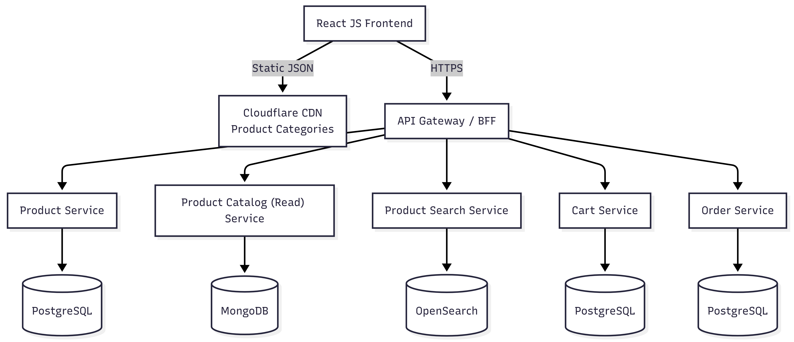

## eBuy – Distributed High-Availability E-Commerce Platform

Appliction with hardcoded data(Deployed in CDN):
https://ebuystore.pages.dev/

### eBuy Overview 

**eBuy** is a cloud-native, high-availability e-commerce platform built using **microservices architecture**, designed to demonstrate **scalability, reliability, low latency, and fault tolerance**—key requirements for large-scale distributed systems.

This project focuses on **real-world system design principles**, domain-driven design, polyglot persistence, event-driven communication, and horizontal scalability.

---

### Key Highlights

- Distributed microservices architecture with independent deployment
- Designed for high availability and fault isolation
- Optimized for low-latency global access
- Event-driven and horizontally scalable system design
- Production-grade technology stack

---

### Architecture Overview

- **Architecture Style:** Microservices
- **Communication:** REST (sync)
- **Kafka:** (async)
- **Containerization:** Docker
- **Scalability:** Horizontal scaling with load balancing
- **Resilience:** Service isolation, caching, and async processing



---

### Technology Stack

#### Frontend
- **Framework:** React.js
- **CDN:** Cloudflare

#### Backend
- **Language & Framework:** Java (Spring Boot)
- **Architecture:** Domain-driven microservices
- **Containerization:** Docker

#### Data & Search
- **PostgreSQL:** Strongly consistent transactional data
- **MongoDB:** Flexible document-based storage
- **OpenSearch:** Low-latency, scalable product search

---

### Implemented Microservices

All services are **Dockerized** and designed with clear ownership boundaries:

- **Product Service**
- **Product Catalog (Read) Service**
- **Product Search Service**
- **Cart Service**
- **Order Service**

Each service can be deployed, scaled, and evolved independently.

---

### Functional Capabilities

- Product management
- Product catalog and search
- Cart and order processing
- Designed to support high read/write traffic scenarios

---

# Ebuy Ecommerce System - Local Deployment Guide

This project is a **microservices-based ecommerce system** consisting of:
- React frontend
- Java (Spring Boot) microservices
- PostgreSQL, MongoDB
- OpenSearch
- Docker & Docker Compose

The following steps describe how to run the entire system **locally**.

---

## 📦 Prerequisites

Ensure the following are installed and running:
- **Node.js (>=18)**
- **Java 17**
- **Docker Desktop**
- **Docker Compose**
- **MongoDB Shell (`mongosh`)**
- **PostgreSQL Client (psql or UI tool)**

---

## 🖥️ Frontend Deployment

```bash
cd <Base Dir>\ecommerce\frontends\ebuy-react-app
npm install
npm run dev

## Product Service (Write Model)
cd <Base Dir>\ecommerce\backends\javams\ebuy-product-service
./gradlew clean build
docker compose up --build

## Product Catalog (Read) Service
cd <Base Dir>\ecommerce\backends\javams\ebuy-product-catalog-read
./gradlew clean build
docker compose up --build

## Product Search Service
cd <Base Dir>\ecommerce\backends\javams\ebuy-product-search
./gradlew clean build
docker compose up --build

## Cart Service
cd <Base Dir>\ecommerce\backends\javams\ebuy-cart-service
./gradlew clean build
docker compose up --build

## Order Service
cd <Base Dir>\ecommerce\backends\javams\ebuy-order-service
./gradlew clean build
docker compose up --build

### Database Initialization
PostgreSQL Databases

Create the following databases and execute the schema scripts:
| Database   | Script Path                                                   |
| ---------- | ------------------------------------------------------------- |
| Product DB | `<Base Dir>\ecommerce\databases\product_db\create_schema.sql` |
| Order DB   | `<Base Dir>\ecommerce\databases\order_db\create_schema.sql`   |
| Cart DB    | `<Base Dir>\ecommerce\databases\cart_db\create_schema.sql`    |

Run using:
psql -d <db_name> -f create_schema.sql

MongoDB – Product Catalog (Read Model)
Initialize MongoDB schema and seed data using JavaScript:
mongosh ebuy_db <Base Dir>\ecommerce\databases\ebuy_db\ebuy_schema.js


### Future Enhancements

The following components are being integrated to complete a production-grade HA setup:

- **Centralized Authentication & Authorization** (Keycloak, RBAC)
- **API Gateway** (routing, rate limiting, cross-cutting concerns)
- **Load Balancer**
- **Distributed Caching** (Redis)
- **Kafka Integration** for event-driven workflows
- **Asynchronous order and payment processing**

---

### Engineering Focus Areas

- Distributed Systems Design
- High Availability & Fault Tolerance
- Low-Latency System Architecture
- Horizontal Scalability
- Event-Driven Architecture
- Polyglot Persistence
- Cloud-Native Best Practices

This project continues to evolve with additional scalability, observability, and reliability features.
